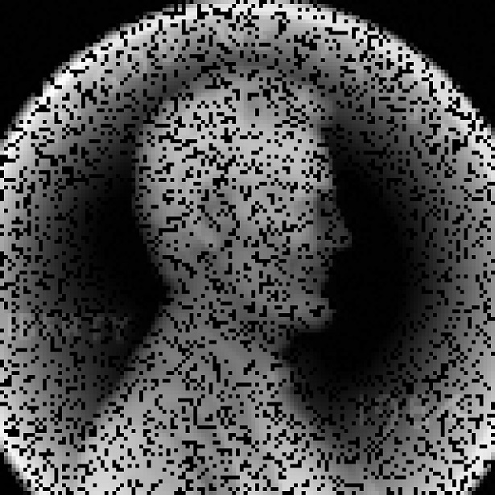

# Data Completion Research

This repository consists of my graduate research on data completion via low-rank matrix and tensor completion, and maximum volume algorithms for finding dominant submatrices of matrices. All algorithms are implemented in MATLAB and/or Python.

## 🔧 Installation


### Clone the Repository:

```
git clone https://github.com/KennethJAllen/ygo-small-world
cd ygo-small-world
```
### Python

#### Set Up Environment

*   Install Poetry if not already installed.
*   Run the following command in the project directory:

```
poetry install
```
#### Activate the Virtual Environment
```
poetry shell
```
You can now run the project's scripts within the poetry shell.

## 🔢 Low-Rank Matrix Completion

Low-Rank matrix completion is the task of completing missing entries of a partially complete matrix subject to the constraint that the rank of the resulting matrix is minimized. This is a non-convex minimization problem, and as such is considered difficult to solve.

### Algorithms
1. alternating projection
2. alternating projection with maximum volume skeleton decomposition (MVSD)
3. schur maximum volume gradient descent

## 🧊 Low-Rank Tensor Completion

Like Low-Rank matrix completion, Low-Rank tensor completion is the task of completing the missing entries of a partially complete tensor subject to the constraint that the rank of the resulting tensor is minimized. Also like low-rank matrix completion, it is also a non-convex minimization problem.

Unlike matrices, there are multiple distinct definitions for the rank of a tensor. In this repository, one tensor completion algorithm is presented which completes partially complete tensors with a particular structure of known entries subject to the constraint that the multilinear rank is minimized.

## 🔼 Maximum Volume

Maximum volume algorithms find $r \times r$ dominant submatrices of matrices. They are used for creating low-rank approximations using the skeleton decomposition. While the singular value decomposition is the gold standard for finding low-rank approximations, the computational complexity is $O(nm^2)$ for an $n \times m$ matrix with $m$ at most $n$. In comparison, the maximum volume skeleton decomposition is significantly faster, while often only increasing the error by a negligible amount.

### Algorithms
##### for $m \times r$ matrices
1. maxvol
2. simple greedy maxvol
3. greedy maxvol
##### for $m \times n$ matrices
4. alternating maxvol
5. algernating greedy maxvol

## Examples 🖼️
Consider the following $128 \times 128$ image of a penny.


Suppose 25% of the pixels are deleted at random.



We would like to recover the missing entries. Using the alternating projection algorithm, we recover the following image.


Using the Schur maximum volume gradient descent method, we recover the following image.


